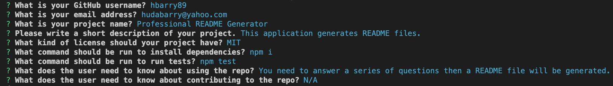
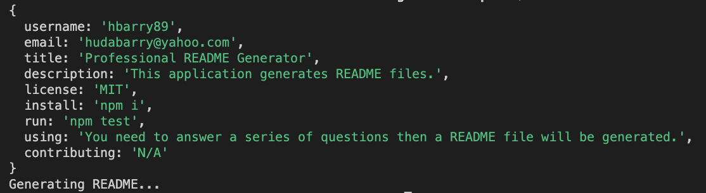
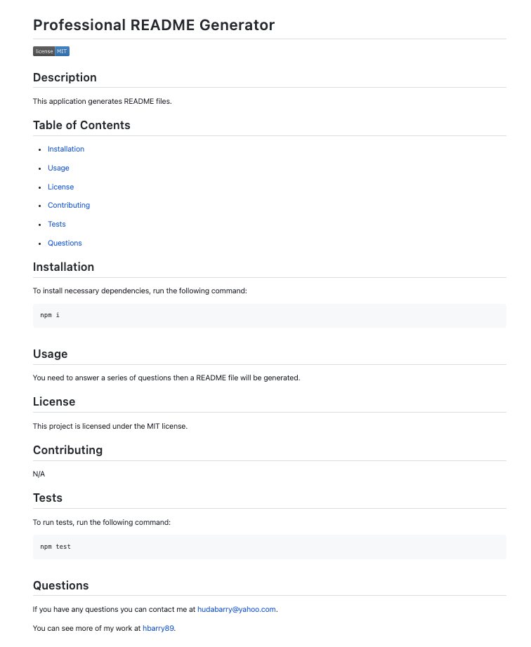

# Professional README Generator

## Description

- The purpose of this repository is for developers to create a quick and a professional README files through a README file generator application.

## Usage

- Checkout this video demo video of this application:

- [Click here](*) for a link to the video demo for your reference.
- [Click here](https://github.com/hbarry89/Professional-README-Generator/blob/main/README-File-Generator/README.md) to see a sample README file created by the generator.

---------------------------

- You will be presented with a series of questions:

---------------------------

- After answering the questions your answers will be captured:

---------------------------

- Then a README file will be generated based on the answers provided.

---------------------------

## Credit

### Resources :books:
- Bootcamp Materials
- Challenge demonstration by TA in class.
- Worked with tutor.
- [Node.js Tutorial for Beginners](https://www.youtube.com/watch?v=TlB_eWDSMt4)

### Assets :gear:
- [Inquirer Package](https://www.npmjs.com/package/inquirer/v/8.2.4)
- Badge Generator: [Shields IO](https://shields.io/category/license)

### Applications Used :sparkles:
- VS Code
- Screencastify

Thank you for visiting! :hibiscus:
